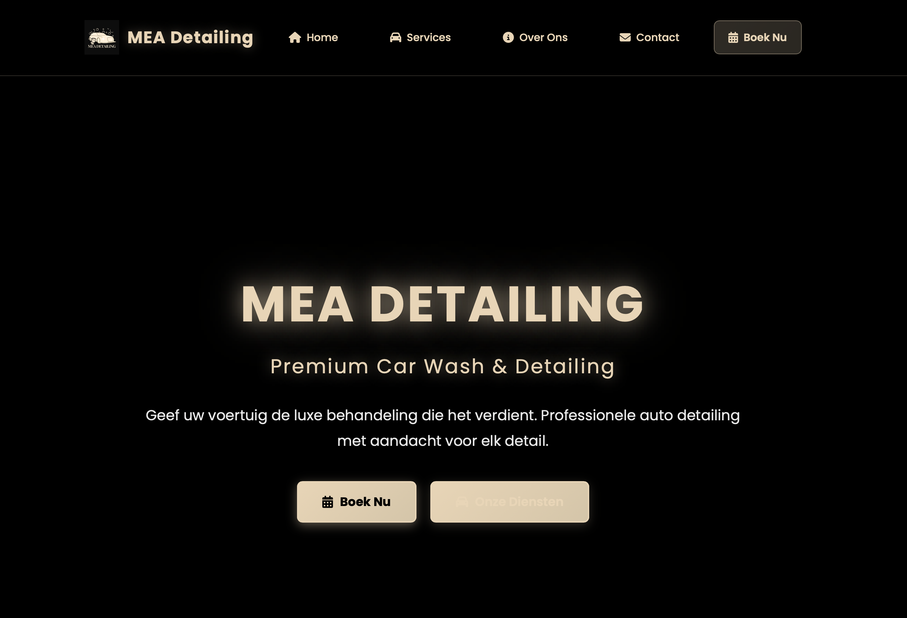
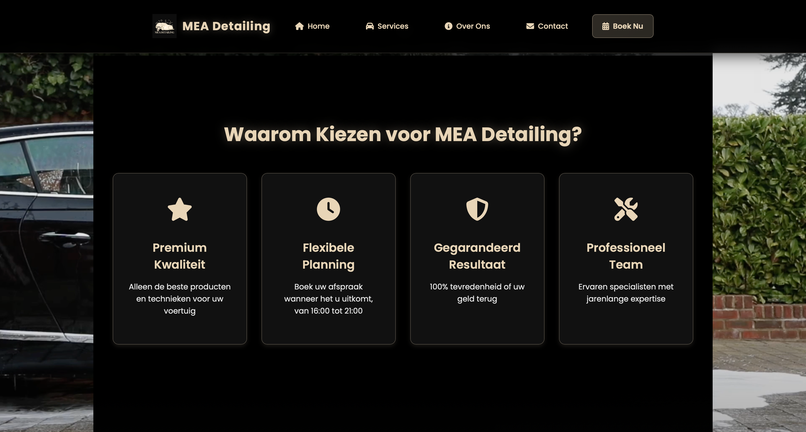
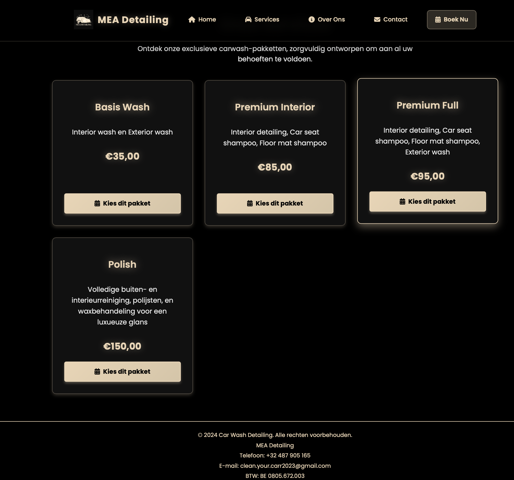
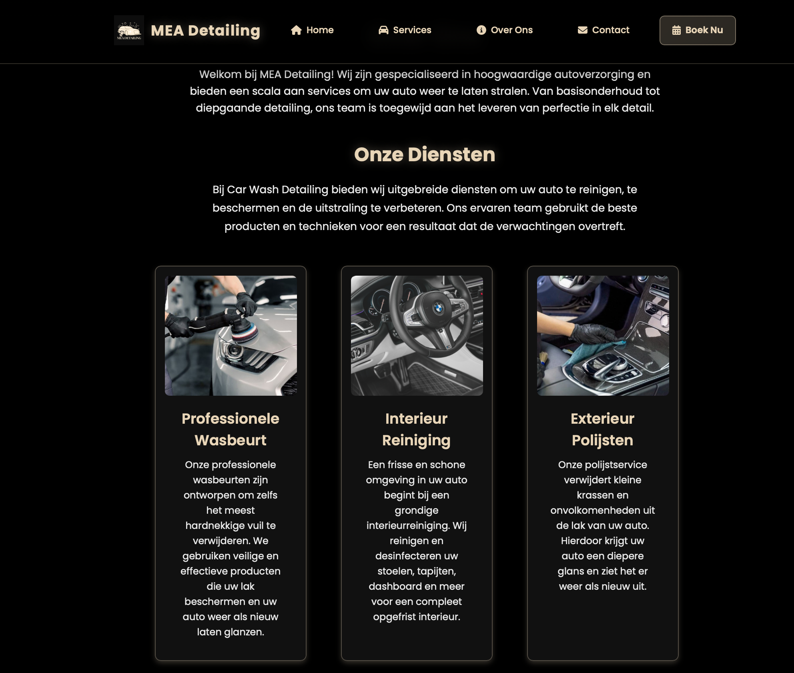
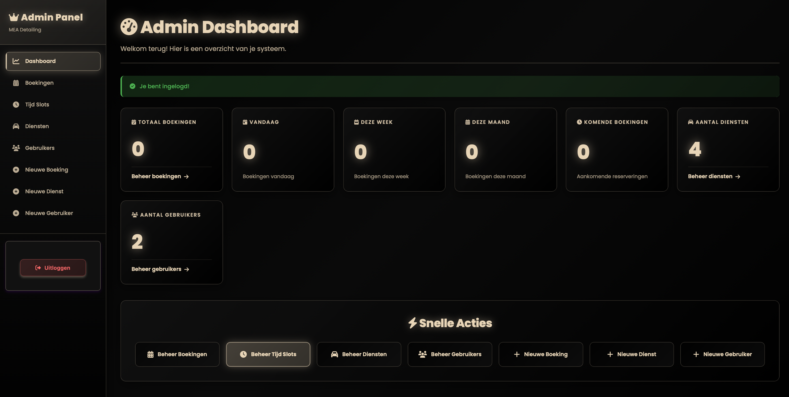

# Carwash Detailling (Laravel Project)

Carwash Detailling is een praktijkproject gebouwd met Laravel (MVC-architectuur) dat gericht is op het aanbieden en beheren van carwash- en detailing-services. De applicatie bevat:

- Gebruikersregistratie en login
- Admin dashboard met gebruikers-, diensten- en boekingenbeheer
- Reserveringssysteem met tijdsloten
- Blade templates voor consistente UI

## Technische details

- Framework: Laravel 10.x
- Auth: Laravel Breeze
- Database: MySQL / SQLite (afhankelijk van omgeving)
- Assets: Vite

## Seeders & Admin

- Er is een `UserSeeder` die een admin gebruiker aanmaakt met:
	- **Email:** `admin@carwash.be`
	- **Wachtwoord:** `password`

- Je kunt de admin ook (aanmaken of bijwerken) via het artisan-commando:

	php artisan admin:create admin@carwash.be YourSecurePassword

	Gebruik deze opdracht om het wachtwoord direct te veranderen.

## Screenshots (geordend) 🖼️

De project-screenshots bevinden zich in `public/screenshot/` en zijn **nummeriek geordend** zodat ze de belangrijkste views en flow van de applicatie tonen.

| Bestand | Voorvertoning | Beschrijving |
|---|---:|---|
| `screen1.png` |  | **Admin Dashboard** — overzichtsscherm wanneer een admin is ingelogd (statistieken, snelle acties).
| `screen2.png` |  | **Home - Diensten** — sectie met diensten en korte omschrijvingen.
| `screen3.png` |  | **Service cards** — gedetailleerde weergave van pakketten en prijzen.
| `screen4.png` |  | **Feature sectie** — 'Waarom kiezen' / voordelen en iconen.
| `screen5.png` |  | **Homepage hero** — grote titel, call-to-action-knoppen en intro-tekst.

Als je liever andere omschrijvingen wilt gebruiken of een andere volgorde wilt markeren, laat het me weten dan pas ik het aan.

## Installatie

1. Clone the repo
2. Composer install: `composer install`
3. Copy `.env.example` → `.env` and set DB credentials
4. Run migrations & seeders: `php artisan migrate --seed`
5. Serve: `php artisan serve`

## Bekende punten & tips

- Pas altijd het admin-wachtwoord aan vóór productie.
- Check `.env` mail-instellingen als je e-mails wil laten werken.

---

Als je wilt dat ik de afbeeldingen ook uitputtend optimaliseer of een afbeelding CDN instel, zeg het even — ik kan dat toevoegen of uitvoeren.
