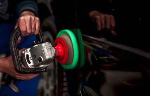
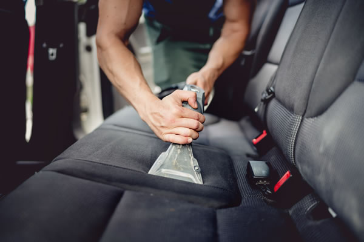

# Carwash Detailling (Laravel Project)

Carwash Detailling is een praktijkproject gebouwd met Laravel (MVC-architectuur) dat gericht is op het aanbieden en beheren van carwash- en detailing-services. De applicatie bevat:

- Gebruikersregistratie en login
- Admin dashboard met gebruikers-, diensten- en boekingenbeheer
- Reserveringssysteem met tijdsloten
- Blade templates voor consistente UI

## Technische details

- Framework: Laravel 10.x
- Auth: Laravel Breeze
- Database: MySQL / SQLite (afhankelijk van omgeving)
- Assets: Vite

## Seeders & Admin

- Er is een `UserSeeder` die een admin gebruiker aanmaakt met:
	- **Email:** `admin@carwash.be`
	- **Wachtwoord:** `password`

- Je kunt de admin ook (aanmaken of bijwerken) via het artisan-commando:

	php artisan admin:create admin@carwash.be YourSecurePassword

	Gebruik deze opdracht om het wachtwoord direct te veranderen.

## Afbeeldingen (public/images)

De volgende afbeeldingsbestanden zijn hernoemd voor duidelijkheid en consistentie. Hieronder staat het nieuwe bestandsnaam - en een korte uitleg over waar het gebruikt wordt:

| Bestand | Uitleg |
|---|---|
| `hero-bg.jpg` |  | Achtergrond / hero afbeelding gebruikt op de homepagina.
| `hero-1.jpg` |  | Extra hero/visual (origineel `foto1.jpg`).
| `hero-2.png` |  | Extra hero/visual (origineel `foto2.png`).
| `site-logo.jpg` |  | Site / dashboard logo (voor navigatie en header).
| `service-wash.jpg` |  | Afbeelding voor "Professionele Wasbeurt" service.
| `service-interior.jpg` |  | Afbeelding voor "Interieur Reiniging" service.
| `service-polish.jpg` |  | Afbeelding voor "Exterieur Polijsten" service.
| `service-premium.jpg` |  | Afbeelding voor "Premium" service.

Deze bestanden worden vanuit Blade-views geladen met `asset('images/<bestandsnaam>')`.

## Installatie

1. Clone the repo
2. Composer install: `composer install`
3. Copy `.env.example` → `.env` and set DB credentials
4. Run migrations & seeders: `php artisan migrate --seed`
5. Serve: `php artisan serve`

## Bekende punten & tips

- Pas altijd het admin-wachtwoord aan vóór productie.
- Check `.env` mail-instellingen als je e-mails wil laten werken.

---

Als je wilt dat ik de afbeeldingen ook uitputtend optimaliseer of een afbeelding CDN instel, zeg het even — ik kan dat toevoegen of uitvoeren.
